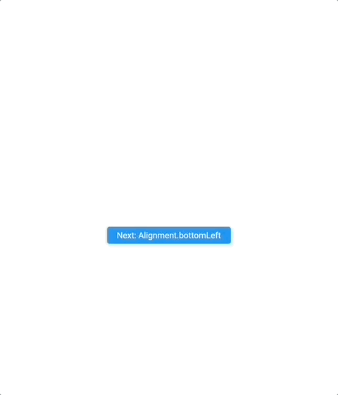
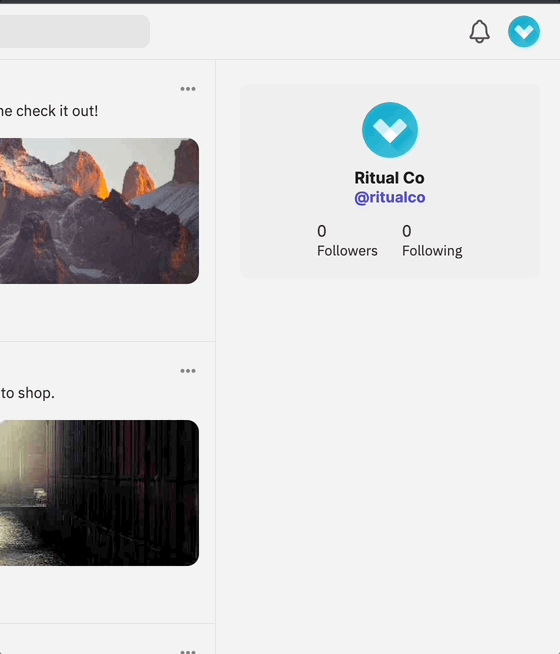
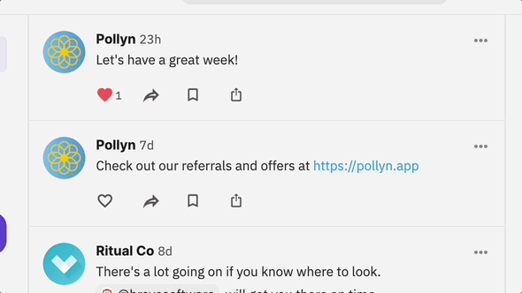

# Relative Dialog

A Flutter package for displaying a dialog using the [showDialog](https://api.flutter.dev/flutter/material/showDialog.html) API relative to the widget associated with the given BuildContext.

.

.

# Anchor

The `RelativeAnchor` widget can be used to wrap the widget that the dialog should be shown relative to.

```dart
Builder(
  builder: (context) {
    return RelativeAnchor(
      builder: (context, {
        required show,
      }) {
        return ElevatedButton(
          child: Text('Show relative dialog'),
          onPressed: () {
            show(
              // The alignment the dialog should be positioned at relative to widget that opened it.
              alignment: Alignment.topRight,
              builder: (context) {
                return Text(
                  'Done!',
                  style: TextStyle(
                    color: Colors.white,
                  ),
                ),
              }
            );
          },
        );
      }
    );
  }
)
```

# Imperative API

Alternatively, if you don't want to use the anchor widget, you can call `showRelativeDialog` directly, passing in the `BuildContext` that
the dialog should be shown relative to: 

```dart
Builder(
  builder: (context) {
    return ElevatedButton(
      child: Text('Show relative dialog'),
      onPressed: () {
        showRelativeDialog(
          // The context of the widget that the dialog should be shown relative to.
          context: context,
          // The alignment the dialog should be positioned at relative to widget that opened it.
          alignment: Alignment.topRight,
          builder: (context) {
            return Text(
              'Done!',
              style: TextStyle(
                color: Colors.white,
              ),
            ),
          }
        );
      },
    );
  }
)
```

# Custom Animations

By default the dialog uses a `FadeTransition` animation, but custom animations can be specified using the `transitionBuilder` API:

```dart
Builder(
  builder: (context) {
    return ElevatedButton(
      child: Text('Show relative dialog'),
      onPressed: () {
        showRelativeDialog(
          context: context,
          alignment: Alignment.bottomRight,
          transitionBuilder: (context, animation, secondaryAnimation, child) =>
            ScaleTransition(
              alignment: Alignment.topRight,
              scale: CurvedAnimation(
                parent: animation,
                curve: Curves.easeOut,
                reverseCurve: Curves.easeIn,
              ),
              child: child,
            ),
          builder: (context) {
            return Text(
              'Done!',
              style: TextStyle(
                color: Colors.white,
              ),
            ),
          }
        );
      },
    );
  }
)
```

.

# Demo

[Full demo](https://github.com/danReynolds/relative_dialog/blob/master/example/lib/main.dart).
