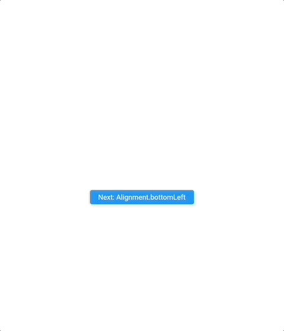

# Relative Dialog

A flutter package for displaying a dialog above the current contents of the app using the [showDialog](https://api.flutter.dev/flutter/material/showDialog.html)API relative to the widget associated with the given BuildContext.

.

.

# Example

```dart
```